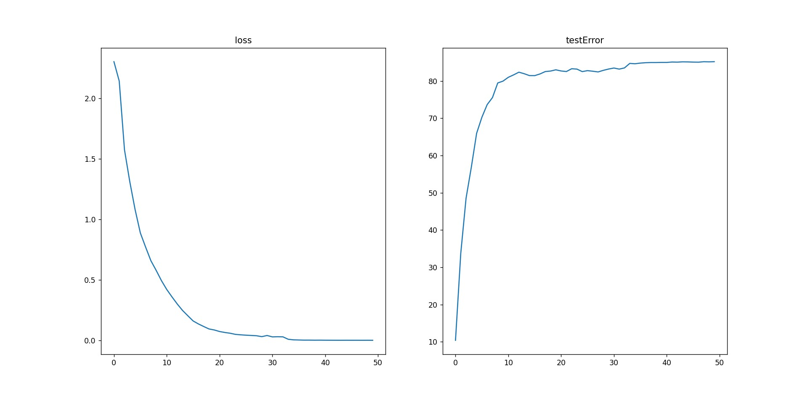

## AlexNet
- 数据集

  网络输入图片尺寸是 224 x 224，且减去均值变为0均值（没有除标准差）。使用两份数据，分别为CIFAR10和自己下载的花朵图片

- 网络结构

  ```python
  self.C1 = nn.Conv2d(3, 96, 11, stride=4, padding=2)
  # self.C1.bias.data = torch.zeros(self.C1.bias.data.size())
  # self.N1 = LRN(96, device=device)
  
  self.C2 = nn.Conv2d(96, 256, 5, stride=1, padding=2)
  # self.C2.bias.data = torch.ones(self.C2.bias.data.size())
  # self.N2 = LRN(256, device=device)
  
  self.C3 = nn.Conv2d(256, 384, 3, stride=1, padding=1)
  # self.C3.bias.data = torch.zeros(self.C3.bias.data.size())
  self.C4 = nn.Conv2d(384, 384, 3, stride=1, padding=1)
  # self.C4.bias.data = torch.ones(self.C4.bias.data.size())
  self.C5 = nn.Conv2d(384, 256, 3, stride=1, padding=1)
  # self.C5.bias.data = torch.ones(self.C5.bias.data.size())
  
  self.F6 = nn.Linear(256*6*6, 4096)
  self.F7 = nn.Linear(4096, 4096)
  self.F8 = nn.Linear(4096, nclass)
  
  self.pool = nn.MaxPool2d(3, stride=2)
  self.dropout = nn.Dropout(0.5)
  self.act = nn.ReLU(True)
  ```

- 训练

  初始化参数：使用论文中的方法初始化会使loss不变，无法训练，故不作初始化（pytorch自动初始化）

  训练方法：SGD，batch_size为128，`(lr = 1.0e-2, momentum=0.9, weight_decay=5.0e-4)`

  损失函数：CrossEntropyLoss()，其中内置了softmax，故不用添加层

  学习率调节：文章根据测试准确率调节，但是很容易使学习率下降太多，故根据loss调节，` (mode='min', factor=0.1, patience=1)`

- 备注

  - 由于使用了dropout层，所以训练时要`self.net.train()`，而测试时要`self.net.eval()`
  - 原文中使用了自定义的LRN数据归一化层，但是使用后发现会使loss不变且训练速度很慢，因此复现是也没有使用
  - 一开始全连接层没有用激活函数，类别也设为了10（花只有5种），因此多了两个log文件
  - 花的数据链接：https://storage.googleapis.com/download.tensorflow.org/example_images/flower_photos.tgz

- 结果

  - CIFAR10
  
  
  - flower
  