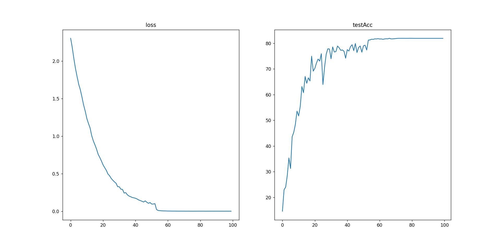
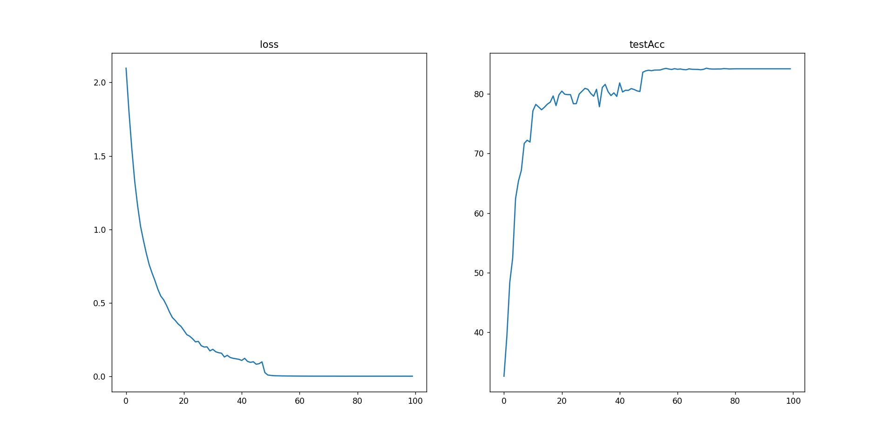
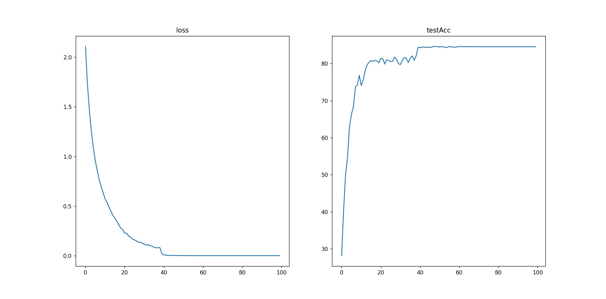

## NiN
- 数据集

  网络输入图片尺寸是 224 x 224，且减去均值变为0均值（没有除标准差）。数据集使用CIFAR10。

- 网络结构

  ```python
  def nin_block(in_channels,out_channels,kernel_size,stride,padding):
      return nn.Sequential(
          nn.Conv2d(in_channels,out_channels,
                    kernel_size,stride,padding),nn.ReLU(),
          nn.Conv2d(out_channels,out_channels,kernel_size=1),nn.ReLU(),
          nn.Conv2d(out_channels,out_channels,kernel_size=1),nn.ReLU(),
      )
  
  def nin():
      net = nn.Sequential(
      nin_block(3,96,kernel_size=5,stride=1,padding=2),
      nn.MaxPool2d(kernel_size=3,stride=2),
      nin_block(96,256,kernel_size=3,stride=1,padding=2),
      nn.MaxPool2d(kernel_size=3,stride=2),
      nin_block(256,384,kernel_size=3,stride=1,padding=1),
      nn.MaxPool2d(kernel_size=3,stride=2),
      nn.Dropout(0.5),
      nin_block(384,10,kernel_size=3,stride=1,padding=1),
      nn.AdaptiveAvgPool2d(output_size=(1,1)),
      nn.Flatten()
      )
      return net
  ```

- 总结

  - 在每个像素的通道上分别使用多层感知机，也就是使用了多个1*1的卷积核。以此来提高网络的稀疏性，把相似的神经元聚类在一起，将不同通道的信息进行了融合，提取高级特征。
  - 最后通过一个全局平均池化层（AdaptiveAvgPool），将输出的维度控制为（-1，10）。一个通道就想到于一个类别，这就等同于全连接层的输出层。

- 训练

  初始化参数：`nn.init.xavier_uniform_(m.weight)`

  训练方法：SGD，batch_size为128，`(lr = 1.0e-2, momentum=0.9, weight_decay=5.0e-4)`

- 结果

  - 原始结果：81.91%
  
  
  - 数据归一化结果：84.21%
  
  
  - 简化网络结构结果：84.55%
  
  